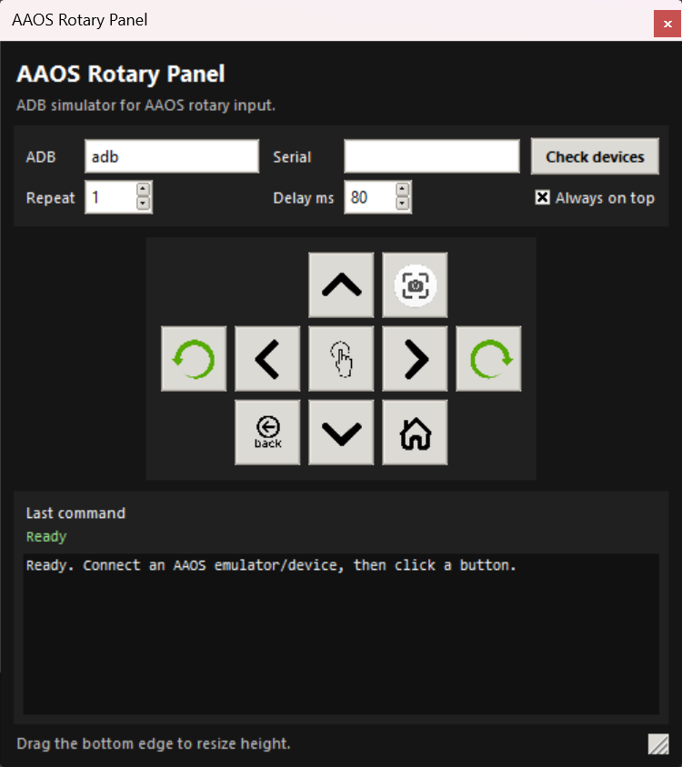

# AAOS Rotary Control Panel

A compact Python Tkinter panel for simulating Android Automotive OS rotary input through ADB.

## Preview

<p align="center">
  
</p>

## Features

- Rotate left / right
- Tilt / nudge up, down, left, right
- Enter / center button
- Home and Back buttons
- Capture device screenshot to the computer Downloads folder using `screencap` + `adb pull`
- Check connected ADB devices
- Repeat and delay controls
- Always-on-top floating window
- Vertically resizable panel while keeping the width compact
- Windows no-terminal launcher via `ccp.pyw`

## Run

Recommended on Windows, without terminal window:

```bash
pythonw ccp.pyw
```

Or double-click:

```text
cpp.pyw
```

Development mode:

```bash
python ccp.py
```

## Notes

- Drag the bottom edge or bottom-right resize grip to change the panel height.
- The width is locked to keep the panel compact beside Android Studio or an emulator.
- Set `ADB` to a full adb path if `adb` is not available in PATH.
- Screenshots are saved as `aaos_screenshot_yyyyMMdd_HHmmss.png` in your computer `Downloads` folder.
- Screenshot capture first creates the PNG on the Android device, then pulls it to the computer to avoid corrupted PNG output on Windows.
